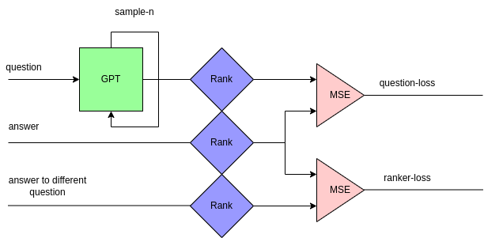

# Architecture for life

Architecture has 4 neural networks.
- Encoder network (h) which transform input representation to latent representation (s).
- Dynamic network (g) which transform from one state to next one.
- Policy network (pi) which selects action from latent representation.
-  Value network (v) which estimates value of each latent state.

Main goal of this project is to demonstrate binary addition for arbitrary length of numbers.
For now main focus is on single task, but it can be extended to multiple tasks.
This can be done by producing value, policy and dynamic networks for each task from transformer network.

# General architecture for life

Main goal of intelligent architecture is to learn new sequential algorithms for solving problems.
To achieve this goal architecture is divided into two parts:
- **Transformer network** which tries to learn new algorithm.
- **Ranker network** which tries to evaluate new algorithm.

Ranker network tries to evaluate given algorithm, and try to predict how good is it.
(how close is it to being optimal, similar to value net).
Then when ranker network is trained, it can be used to predict score of new algorithm.
For learning new algorithm GPT like architecture is used. Because it is harder to generate right algorithm GPT must be sampled.

Ranker network is simpler than transformer network because it is not trying to learn new algorithm. Hence it can be smaller and faster to train.

Whole architecture can also be flipped to generate question from answer.

This leads to training generator network which generates questions from answers. And then ranker network is trained to evaluate new questions. This is called **generator-ranker** architecture. And can be bootstrapped to generate solution to harder problem.

Inverted **generator-ranker** network can be thought as world model upon which generator network is trained.
