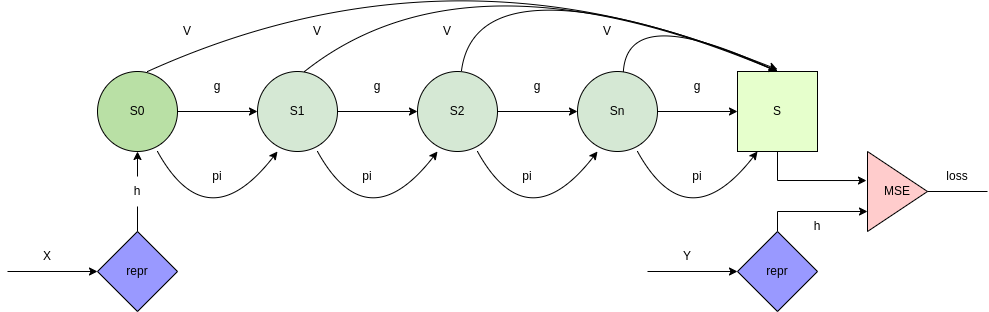

# Architecture for life

Architecture has 4 neural networks.
- Encoder network (h) which transform input representation to latent representation (s).
- Dynamic network (g) which transform from one state to next one.
- Policy network (pi) which selects action from latent representation.
-  Value network (v) which estimates value of each latent state.

Main goal of this project is to demonstrate binary addition for arbitrary length of numbers.
For now main focus is on single task, but it can be extended to multiple tasks.
This can be done by producing value, policy and dynamic networks for each task from transformer network.